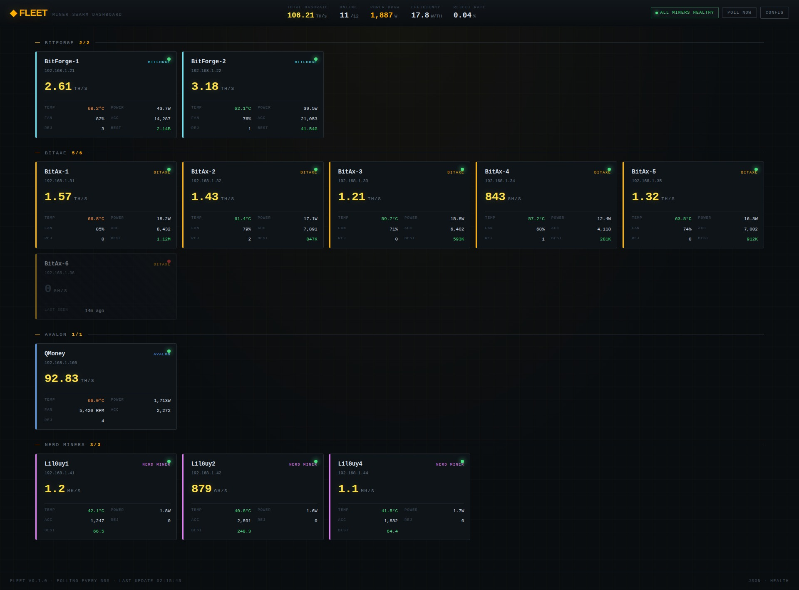

# ⚡ FleetSwarm

> **Unified dashboard for mixed Bitcoin SHA-256 ASIC fleets.**
> One pane of glass for Bitaxe, BitForge, Avalon, and Nerd Miner devices —
> regardless of which firmware they run.

[](LICENSE)
[](https://github.com/gbechtel-beck/umbrelsolostrike-app-store)
[](https://github.com/gbechtel-beck/fleetswarm/pkgs/container/fleetswarm)



---

## Why this exists

Most miner monitoring tools are **single-protocol**: they speak AxeOS REST and
that's it. Fine if your whole fleet is Bitaxes, useless if you also have an
Avalon Q on CGMiner TCP, plus Nerd Miners on a slightly different firmware,
plus you want pool-side cross-reference for anything that escapes the IP list.

FleetSwarm runs **three protocols** in one poller:

| Hardware | Protocol | Port | What it reads |
|---|---|---|---|
| Bitaxe (Gamma, Supra, Ultra, Hex) | AxeOS REST | 80 | `/api/system/info` |
| BitForge | AxeOS REST | 80 | Same — AxeOS-derived firmware |
| Nerd Miner / NerdQAxe family | AxeOS REST | 80 | Same — AxeOS-compatible builds |
| Avalon Q (and other CGMiner ASICs) | CGMiner TCP | 4028 | `estats` + `summary` + `pools` |
| SoloStrike / Public Pool *(optional)* | HTTP API | varies | Worker cross-reference |

Subnet auto-discovery sweeps a `/24` every cycle. New miner shows up in 30
seconds without any config changes.

---

## Features

- **Fleet-wide hashrate, power, efficiency** at the top of every page
- **Configurable health thresholds** for temperature, reject rate, and
  offline duration — the header pill flips green/orange/red based on rules
  you set
- **Per-miner cards** color-coded by class (BitForge cyan, Bitaxe amber,
  Avalon blue, Nerd magenta)
- **Temperature alerting via color** — green/orange/red against your bands
- **Offline detection** with diagonal-stripe styling + "last seen" timestamp
- **14-day SQLite history** with per-miner time-series API endpoint
- **Force poll** button for instant refresh without waiting for the cycle
- **Industrial terminal aesthetic** — dense, glanceable, no decorative cruft
- **Universal** — no utility-specific or region-specific assumptions
- **No telemetry. No phone-home. No cloud.** Polls on your LAN, stores on
  your disk, serves to your browser. That's it.

---

## Install

### Option 1 — Umbrel (one-click, recommended)

1. Add the SoloStrike community app store: **App Store → ⋯ → Community App
   Stores → Add** and paste:

   ```
   https://github.com/gbechtel-beck/umbrelsolostrike-app-store
   ```

2. Find **FleetSwarm** under that store and click **Install**.

3. Open it. Go to **Config**, add your Avalon IP (if any), and tweak the
   alert thresholds if the defaults don't fit your hardware.

### Option 2 — Plain Docker / Docker Compose

```yaml
version: "3.7"
services:
  fleetswarm:
    image: ghcr.io/gbechtel-beck/fleetswarm:latest
    restart: unless-stopped
    ports:
      - "8888:8888"
    volumes:
      - ./fleetswarm-data:/data
    environment:
      POLL_INTERVAL: "30"
      DEFAULT_SUBNET: "192.168.1.0/24"
      # Optional: set your timezone for accurate log timestamps
      # TZ: America/New_York
```

```bash
docker compose up -d
```

Open `http://<host>:8888`.

---

## Configuration

All settings are in the web UI under `/config`. Persisted to
`/data/config.json` so they survive container restarts and image updates.

| Field | Default | Notes |
|---|---|---|
| Subnet (CIDR) | `192.168.1.0/24` | `/24` only for the auto-scan |
| Subnet scan enabled | ✅ | Disable if you have a fixed IP list |
| Avalon IPs | empty | One per line — required for Avalon Q (CGMiner TCP) |
| Manual AxeOS IPs | empty | Useful for static IPs outside the scanned subnet |
| BTC payout address | empty | For Public Pool / SoloStrike worker cross-ref |
| Pool API base URL | empty | Same |
| Temp Warning (°C) | 65 | Card turns orange above this |
| Temp Critical (°C) | 75 | Card turns red, fleet alert flips critical |
| Reject Rate Warning (%) | 1.0 | Per-miner reject % that triggers warning |
| Offline Grace (min) | 5 | Offline-longer-than-this counts as critical |

Thresholds are universal — no hard-coded utility-specific or region-specific
assumptions. Set them to whatever fits your hardware and tolerance.

---

## API

| Endpoint | Method | Purpose |
|---|---|---|
| `/` | GET | Dashboard UI |
| `/config` | GET | Settings UI |
| `/api/fleet` | GET | Current state for all miners + totals |
| `/api/miner/<id>/history?hours=24` | GET | Per-miner time series |
| `/api/config` | GET / POST | Read or update config |
| `/api/poll-now` | POST | Force an immediate poll cycle |
| `/api/health` | GET | Heartbeat |

---

## How polling works

Every 30 seconds (configurable via `POLL_INTERVAL`), the background thread:

1. Polls every IP in your **explicit miner list** via AxeOS HTTP
2. Polls every IP in your **Avalon list** via CGMiner TCP `estats`
3. Scans your **subnet** for any AxeOS responders not already known
4. Writes one row per miner per cycle to the `samples` table
5. Marks any miner that didn't respond as offline
6. Prunes samples older than 14 days

The web UI re-fetches `/api/fleet` every 5 seconds for snappy redraw without
adding load to the miners.

---

## Troubleshooting

```bash
# Logs
docker logs -f umbrelsolostrike-fleetswarm_web_1            # on Umbrel
docker logs -f fleetswarm                            # plain docker

# Inspect the database
docker exec -it <container> sqlite3 /data/fleet.db
sqlite> SELECT hostname, kind, online FROM miners;
sqlite> SELECT hostname, hashrate_ghs, ts FROM samples
   ...> JOIN miners ON miners.id = samples.miner_id
   ...> ORDER BY ts DESC LIMIT 20;

# Force a poll cycle
curl -X POST http://<host>:8888/api/poll-now

# Reset everything (config + DB)
docker stop <container>
rm /path/to/data/fleet.db /path/to/data/config.json
docker start <container>
```

---

## Roadmap

- [ ] Per-miner detail page with hashrate sparkline
- [ ] Pool websocket cross-reference (Public Pool / SoloStrike)
- [ ] Discord webhook alerts on offline > N minutes
- [ ] Auto-detect Avalon during subnet scan (probe TCP 4028)
- [ ] CSV export for history / accounting
- [ ] Optional cost tracking module — flat-rate or time-of-use, fully
      user-defined (off by default, no region assumptions)
- [ ] Per-pool grouping in addition to per-class

---

## Building from source

```bash
git clone https://github.com/gbechtel-beck/fleetswarm
cd fleetswarm
docker build -t fleetswarm:dev .
docker run -d -p 8888:8888 -v $(pwd)/data:/data fleetswarm:dev
```

To trigger a release build that publishes to Docker Hub:

```bash
git tag v0.1.0
git push origin v0.1.0
```

The GitHub Actions workflow will build a multi-arch image (amd64 + arm64) and
push it to Docker Hub. The workflow's last step prints the digest you need to
pin in the Umbrel app's `docker-compose.yml`.

---

## License

MIT. Do whatever you want with it. Attribution appreciated, not required.

---

## Acknowledgements

- The **Bitaxe** community for AxeOS and the open-source mining renaissance
- **Skot** for kicking the whole thing off
- **[Stu1958](https://github.com/Stu1958/miner-swarm-dashboard)** for the
  ESP32-CYD miner-swarm-dashboard firmware that inspired the name and the
  spirit of "look at it and instantly know your fleet is healthy."
  Different architecture, same mission.
- Everyone in the **OSMU** Discord
